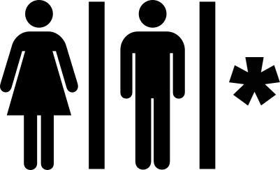

# Resources

Useful resources and things created and gathered for RustFest

## All-gender restroom sign

Our all-gender restroom sign was adapted from the public domain
[unisex public toilet sign][unisex-sign].
It's meant to represent people of ALL genders: Women, men and everyone else who
doesn't fall into any of these categories.

We also put signs with a text adapted from [@LGBTplusBristol's tweet][tweet1]
at the walls in/near the restrooms.
(See [this tweet by a visitor][tweet2] for reference.)
If your venue has any binary-gendered toilets (men's/women's), we highly
recommend adopting these signs as well.

An alternative solution for the "confusing" gender neutral toilet sign issue
was suggested [at "it's pronounced metrosexual" blog][blog].
While we did not use the proposed sign due to unclear licensing conditions, it
served as an inspiration.

## Links

* [Ferris the crab][Ferris] (awesome vector graphic images of the unofficial
  Rust mascot, public domain)
* [Quiet room information and sample text][quiet-room] by the AdaCamp toolkit
* [Scent and smoking policy][scent-policy] by the AdaCamp toolkit

[unisex-sign]: https://en.wikipedia.org/wiki/File:Toilets_unisex.svg
[tweet1]: https://twitter.com/LGBTplusBristol/status/526064732743421952
[tweet2]: https://twitter.com/ujh/status/777076650966183937
[blog]: http://itspronouncedmetrosexual.com/2014/04/gender-neutral-bathroom-sign/
[ferris]: http://www.rustacean.net/
[quiet-room]: https://adacamp.org/adacamp-toolkit/quiet-room/
[scent-policy]: https://adacamp.org/adacamp-toolkit/policies/#scent
